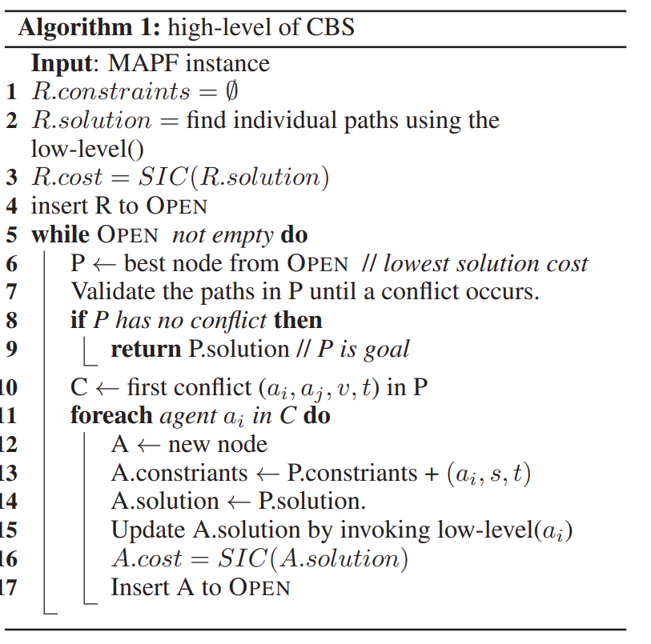

* [Programming Code Performance](#programming-tasks):
    *  [Practice](#practice)
    *  [Part 0 ](#part-0-0-mark-but-critical)
    *  [Part 1](#part-1)
    *  [Part 2](#part-2)
    *  [Part 3](#part-3)

### Programming Tasks:

You **must build and submit your solution** using the sample code we provide you in this repository, which is different from the original [UC Berkley code base](https://inst.eecs.berkeley.edu/~cs188/fa18/project1.html).  

* You should **only work and modify** file [search.py](search.py) in doing your solution. Do not change the other Python files in this distribution.

* Your code **must run _error-free_ on Python 3.8**. Staff will not debug/fix any code. Using a different version will risk your program not running with the Pacman infrastructure or autograder. 

* You can set up your local environment:
    * You can install Python 3.8 from the [official site](https://peps.python.org/pep-0569/), or set up a [Conda environment](https://www.freecodecamp.org/news/why-you-need-python-environments-and-how-to-manage-them-with-conda-85f155f4353c/) or an environment with [PIP+virtualenv](https://uoa-eresearch.github.io/eresearch-cookbook/recipe/2014/11/26/python-virtual-env/). 
    * You need to install additional package (func_timeout) using:  `pip3 install func_timeout`

* Alternatively, you can use docker:
    * You need to install docker from the [official site](https://docs.docker.com/get-docker/)
    * Please check [Docker Run](#docker-run) to run your code.
> [!TIP] 
> Furthermore, if you would like to visualise your result, you may need to install python package **tkinter**: Run the following command ``pip install tk`` 


#### Practice

To familiarise yourself with basic search algorithms and the Pacman environment, it is a good start to implement the tasks at https://inst.eecs.berkeley.edu/~cs188/fa18/project1.html, especially the first four tasks; however, there is no requirement to do so.

You should code your implementations *only* at the locations in the template code indicated by ```***YOUR CODE HERE***``` in files [search.py](search.py), please do not change code at any other locations or in any other files.

> [!TIP]
> You can use the `autograder` file locally to get feedback about your progress. The test cases are included in the test_cases subfolder. You can create your own tests too! Note that the autograder does not necessarily reflect your grade.


#### Part 1 

Implement **a good heuristic function** for A* algorithm (already implemented). Inserting your code into the template indicated by the comment ```*** YOUR CODE HERE FOR TASK 1 *** ```. You can view the code location at the following link: [search.py#L129](search.py#L129). 

>[!TIP] 
> You can implement other helper classes/functions. 

> [!Note]
> You don't have to implement A* Algorithm, as this has already been implemented for you in the codebase. Make sure A* calls the heuristic you implemented. You should be able to test the algorithm using the following command:

```
python pacman.py -l mediumMaze -p SearchAgent -a fn=astar,prob=FoodSearchProblem,heuristic=foodHeuristic
```
>[!IMPORTANT] 
> Please do not change the arguments used above, unless you want to test a different functionality :wink:. You can explore other options via ``python pacman.py -h``. 


The `autograder` seeks an optimal solution length within the time budget (**10 seconds**) for each test case. The node expansion number will directly impact your result, please inspect the `autograder` for further thresholds information. In addition, please make sure your heuristic is **admissible**, otherwise you may not get full marks for this part due to not finding the optimal plan.

You will see in first person the balance between 1) how informed you make your heuristic (it should expand less nodes in general), and 2) the overall runtime. As you can see, sometimes it may be preferable to have a cheaper less informed heuristic, even if you end up expanding more nodes.

Other layouts are available in the [layouts](layouts/) directory, and you can easily create you own. 
#### Part 2

We often need to consider more than one agent. This part involves solving a more complicated problem as if it were a single agent problem. You will be able to model this new type of problem following the instructions below.

**Multi-Agent Pathfinding problems (MAPF)** involve a set of agents, each with a start and goal location. The goal of the problem is to find paths for all the agents so that they can **simultaneously** travel along these paths without colliding with each other. Realistic applications of these problems include automated warehouses and autonomous vehicles driving. [Check this video out to understand the real-world application of what you are about to solve](https://www.youtube.com/watch?v=LDhJ5I89H_I).


This is similar to problem 7 (practice part) of the Berkeley Pacman framework. You need to model the state space of a problem with multiple agents. Each agent has a target food of its own in the maze. Our task is to control all agents to eat all their corresponding food (points) in the maze. In other words, all agents need to **visit their corresponding target food position at least once**, but they do not neeed to stay at that position after that. 

In order to implement this, there is a new problem called `MAPFProblem` provided to you. Some of the variables are listed in the code comment blocks and the initialization for the functions. You will need to:

1. Make sure `isGoalState` recognises whether the current state is a goal state. 
2. Implement your transition function in `getSuccessors`, which should return a list of tuples that contain (`next_state`, `action_dict`, `cost`). `next_state` and `action_dict` should follow the required format detailed below. The cost would just be 1. Intuitively, each tuple contains all the possible successors states, where each successor is defined by the next state after all pacmans move simultaneously through the actions specified by the action dictionary.

- A search_state in this problem is a tuple in the format of `( pacmanPositions, foodGrid )` where:

        pacmanPositions:  a dictionary {pacman_name: (x,y)} specifying Pacmans' positions
        foodGrid:         a Grid (see game.py) of either pacman_name or False, specifying the target food of each pacman.

- An action_dict is a dictionary `{pacman_name: direction}` specifying each pacman's move direction, where direction could be one of 5 possible directions in Directions (i.e. Direction.SOUTH, Direction.STOP etc)


> [!NOTE]
> You can check more details in this review [paper: Multi-Agent Pathfinding: Definitions, Variants, and Benchmarks](https://ojs.aaai.org/index.php/SOCS/article/download/18510/18301), which elaborates further detail about **MAPF** and the possible **collisions** that can occur in our problem:

For this part, you need to make sure these collisions are avoided:
1. **Vertex Collision:** agents attempt to access the same position at the same time.
2. **Swapping Collision:** agents attempt to swap their positions at the same time. In other word, agents would crash into each other. 

>[!TIP] 
> Whether or not a **collision** is likely to occur is closely related to the nature of the problem itself. There are more conflict types, as there are several MAPF problem variants. If you are interested in further explanations of these conflicts (including the above 2), please refer to the original paper for more details and let us know your thoughts about the possible challenges you forsee to handle these conflicts given your experience with the assignment. 


You should insert your code into the template indicated by the comments ```*** YOUR CODE HERE FOR TASK 2 ***```, you can view the locations at these links:  [search.py#L158](search.py#L158) and [search.py#L177](search.py#L177).

>[!TIP]
> The autograder checks the number of successors for each step in the returned path using a Breadth First Search algorithms. 


> **Optional**
> We encourage you to test your submission locally with your own layouts by editing `test_cases_assignment1/part2/MAPF_test.test`. 

You should be able to test your program by running the local`auto_grader`. 


#### Part 3
Solutions to multi-agent path planning problems can usually be categorized into two types: **Coupled** and **Decoupled** methods. The **Coupled** approach considers all agents together to find the best solution, as we did in part 2. However, the coupled approach taken in part 2 cannot scale to large size problems, this is why this part will introduce a new hybrid coupled and decoupled algorithm knwon as **Conflict Based Search (CBS)**, which has revolutionised this field. 

**Conflict Based Search (CBS)** is a **two-level** algorithm that consists of two parts: **low-level** search and **high-level** search. The algorithm first performs a low-level search, executing a search for each agent to find the corresponding optimal path to satisfy the constraints imposed by the high-level **CT (Conflict Tree)** node. Then, the algorithm moves onto the high-level search phase, which utilises the Conflict Tree to fix possible conflicts.

**Conflict Tree** is a tree structure constructed based on conflicts between individual agents' paths, where each node represents a set of constraints on the movement of an agent. These restrictions reflect the conflicts that may occur at a corresponding time if the pacman is at a certain location. The deeper level nodes of the conflict tree contain more constraints than the shallow nodes in the tree, as each successor may add a new constraint resulting from the new computed path if a conflict exists.


> [!NOTE] 
> Just like part 2, each agent has a target food of its own in the maze. Our task is to control all agents to eat all their corresponding food (points) in the maze, in other words, all agents need to **visit their corresponding food position at least once**, but they are not necessary to be at that position after that. 
> However, unlike part 2, right now we are trying to minimise the sum of the path costs, because now each agent may have different path length. The sum of costs is also known as flowtime.

> [!TIP]
> * **Low-level Algorithm**: Please adapt the implementation of **A\*** from part1. This **A\* variant** algorithm needs to **handle the set of constraints** properly to make sure that the returned path does respect them. You should also implement a low-level heuristic function accordingly, e.g. an Distance. 
> * You may break ties over the `lowest solution path cost` **randomly**.

>[!IMPORTANT]
> **The Output** should be a dictionary containing the path for each pacman as a list `{pacman_name: [action1, action2, ...]}`.




> **Optional**
> We encourage you to test your submission locally with your own layouts by editing `test_cases_assignment1/part3/cbs_test.test`. 


This algorithm is taken from the [paper](https://people.engr.tamu.edu/guni/Papers/CBS-AAAI12.pdf) presented at the AAAI Conference on Artificial Intelligence, in Febuary, 2015. 
Multi-agent Path-finding problem is currently a hot research topic given recent theoretical results and simple practical algorithms such as CBS. This context alone should motivate you: you are literally implementing a cutting-edge search algorithm with a huge appetite from industry, seeking experts in this area.


Implement the **CBS algorithm** discussed above by inserting your code into the template indicated by comment ```*** YOUR CODE HERE FOR TASK 3 ***```, you can view the location at this link: [search.py#L190](search.py#L190). 

You should be able to test your program by running the local `auto_grader` or online server grader. And we will check if the final solution is valid and optimal.